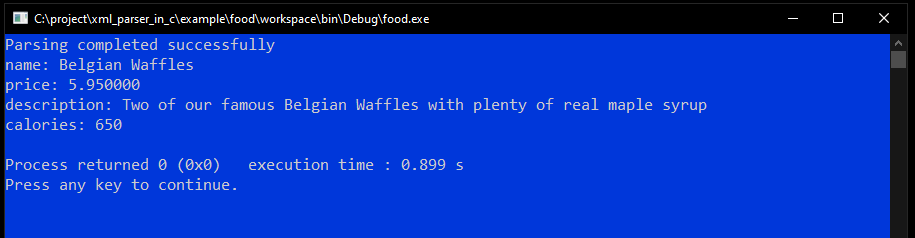

food.xml
========

This example demonstrate the parsing of an XML using static addressing method.
In this method the target address to store XML content is specified at compile time.

## Schema
Schema of XML data to be parsed.

```XML
<?xml version="1.0"?>
<xs:schema xmlns:xs="http://www.w3.org/2001/XMLSchema">
 <xs:element name="food">
    <xs:complexType>
      <xs:sequence>
        <xs:element type="xs:string" name="name"/>
        <xs:element type="xs:float" name="price"/>
        <xs:element type="xs:string" name="description"/>
        <xs:element type="xs:unsignedInt" name="calories"/>
      </xs:sequence>
    </xs:complexType>
  </xs:element>
</xs:schema>
```

The schema of above XML file is defined here [food.xsd][1].
the root element of this XML is "food". It contains four child elements,
- name        : Name of food item
- price       : Price of food item
- description : Description of food item
- calories    : Calories of food item

## food_t
[food.c][3] contain a global variable `food_t waffle;`, where we shall extract the content of XML data.
*food_t* is a structure defined in [food.h][2].

```C
typedef struct
{
    char* name;           //!< Holds content of "name" XML element
    float price;          //!< Holds content of "price" XML element
    char* description;    //!< Holds content of "description" XML element
    uint32_t calories;    //!< Holds content of "calories" XML element
}food_t;
```

## xs_element_t
[food.c][3] file contains xs_element_t structure for all the elements of XML schema including root element "food".
The *xs_element_t* structure contains all the validation rules of an XML element specified in the schema.

- *xs_element_t food_element;*       : holds properties of root element "food".
- *xs_attribute_t food_attribute*    : holds properties of attributes of root element "food".
- `xs_element_t food_descendant[4]`  : holds properties of all the child elements of root element "food".
  Each element of an array represent child elements like *name*, *price*, *description* and *calories* sequentially.
  Each element also hold the address of target address statically.
  e.g.
```
  food_descendant[0].Target.Address  = &waffle.name,
  food_descendant[1].Target.Address  = &waffle.price,
  food_descendant[2].Target.Address  = &waffle.description,
  food_descendant[3].Target.Address  = &waffle.calories,
```

## How to build and run
This example doesn't use any platform or OS specific libraries. You only need standard C99 compiler to build this example.
No need to change any configuration/#define in the parse_xml.c file.

This is a console application. When you execute/run this example it prints extracted XML data on the console.



[1]: xml/food.xsd
[2]: src/food.h
[3]: src/food.c
