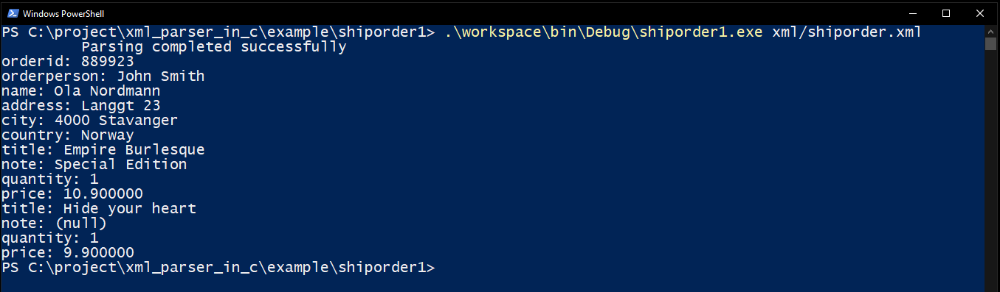

shiporder1
==========

This example demonstrate the parsing of an XML data using relative addressing method.
In this method the target address to store XML content is deduced at runtime. 
The target address of an XML element is relative to its parent's target address.
It is calculated based by adding offset to parent target address.

`target address = parent target address + offset`

Where,
- target address: Address to store content of an XML element.
- parent target address: Target address of a parent element. This can be static, dynamic or relative.
- offset: 32-bit offset value specified in the element *Target.Offset*.

The relative addressing method is useful in case if target address can not be specified statically at compile time.
You just need to specify the offset to the parent target address. 

## Schema
Schema of XML data to be parsed.

```XML
<?xml version="1.0" encoding="UTF-8" ?>
<xs:schema xmlns:xs="http://www.w3.org/2001/XMLSchema">

<xs:element name="shiporder">
  <xs:complexType>
    <xs:sequence>
      <xs:element name="orderperson" type="xs:string"/>
      <xs:element name="shipto">
        <xs:complexType>
          <xs:sequence>
            <xs:element name="name" type="xs:string"/>
            <xs:element name="address" type="xs:string"/>
            <xs:element name="city" type="xs:string"/>
            <xs:element name="country" type="xs:string"/>
          </xs:sequence>
        </xs:complexType>
      </xs:element>
      <xs:element name="item" maxOccurs="10">
        <xs:complexType>
          <xs:sequence>
            <xs:element name="title" type="xs:string"/>
            <xs:element name="note" type="xs:string" minOccurs="0"/>
            <xs:element name="quantity" type="xs:positiveInteger"/>
            <xs:element name="price" type="xs:decimal"/>
          </xs:sequence>
        </xs:complexType>
      </xs:element>
    </xs:sequence>
    <xs:attribute name="orderid" type="xs:string" use="required"/>
  </xs:complexType>
</xs:element>

</xs:schema>
```

The schema of above XML file is defined here [shiporder1.xsd][1].
the root element of this XML is "shiporder". It contains three child elements, and one attribute
- orderperson  : Name of person to ship order
- shipto       : Address
- item         : Description of items to be shipped

- orderid      : order id.


## shiporder_t
The structure *shiporder_t* represents data structure defined in the above schema. This structure can hold the content of XML data. It is defined in [shiporder.h][2].

```C
//! Represents the data structure of shiporder XML schema
typedef struct
{
    char* orderperson;    //!< Holds content of "orderperson" XML element
    shipto_t shipto;      //!< Holds content of "shipto" XML element
    item_t item[10];      //!< Holds content of "item" XML element
    char* orderid;        //!< Holds content of "orderid" attribute
}shiporder_t;

//! Represents the data structure of "shipto" element defined in the XML schema
typedef struct
{
    char* name;     //!< Holds content of "name" XML element
    char* address;  //!< Holds content of "address" XML element
    char* city;     //!< Holds content of "city" XML element
    char* country;  //!< Holds content of "country" XML element
}shipto_t;

//! Represents the data structure of "item" XML element
typedef struct
{
    char* title;        //!< Holds content of "title" XML element
    char* note;         //!< Holds content of "note" XML element
    uint32_t quantity;  //!< Holds content of "quantity" XML element
    float price;        //!< Holds content of "price" XML element
}item_t;

```

## xs_element_t
[shiporder.c][3] file contains *xs_element_t* structure for all the elements of XML schema including root element "shiporder".
This structure contains all the validation rules of an XML element specified in the schema.
It also specifies the target address to store the content of an XML element.

- **xs_element_t shiporder_element**     : Holds properties of root element "shiporder".
- **xs_attribute_t shiporder_attribute** : Holds properties of attributes of root element "shiporder".
- **xs_element_t shiporder_descendant**  : Holds properties of all the child elements of root element "shiporder". Child elements: orderperson, shipto, item
- **xs_element_t shipto_descendant**     : Holds properties of all the child elements of "shipto" XML element. Child elements: name, address, city, country
- **xs_element_t item_descendant**       : Holds properties of all the child elements of "item" XML element. Child elements: title, note, quantity, price

In this example target address type for all the elements are relative (EN_RELATIVE). i.e. Target address of an element is an offset to target address of its parent element.
For root element, target address is offset to address passed in the 3rd argument (void* const target) of `parse_xml` function. 

In the example, address of local variable *book* (`shiporder_t book;`) is passed to parse_xml function. 
The `Target.Offset` of root (shiporder) element  is zero.
Hence, target address of *shiporder* element is *&book*.

### Example to deduce target address of orderpersion element.

`target address = parent target address + offset`

Where,
- target address: Address to store content of an *orderperson* element
- parent target address: Target address of a parent element *shiporder*. i.e. `&book`
- offset: 32-bit offset value specified in the *orderperson* element. i.e. `offsetof(shiporder_t, orderperson)`.

Hence, 
```
target address = &book + offsetof(shiporder_t, orderperson)
               = &book.orderperson
```

## Handling mulitple occurrence of an element

The maxOccurs of "item" element is 10. It can occur in an XML data from 1 to 10 times.
One way to handle multiple occurrence is to use array (item[10]) to hold the content of item elements.

Moreover, It is also necessary to know number of "item" elements present in the XML data. 
To get the number of "item" elements in the XML data, this example uses callback function and context argument.

- **Callback function**: The example uses *itemCallback* function to be called for each occurrence of item element.
The parser calls this callback when it completes the parsing **item** element including its child elements.

- **context**: A counter variable *itemQuantity* is passed to *parse_xml* function as a context. This context is also passed to callback functions.
The *itemCallback* function increments *itemQuantity* for every invocation.

## How to build and run

This example doesn't uses any platform/OS specific libraries. You only need standard C99 compiler to build this example.

This example uses element callback and user defined context in the XML parser. By default callback for element and context are disabled to save code space.
Enable element callback by defining **XML_PARSER_CALLBACK** to 1. Similarly Enable user defined context argument in parse_xml function by defining **XML_PARSER_CONTEXT** to 1.
Use compiler -D option to set these macros, e.g. `-DXML_PARSER_CALLBACK="1" -DXML_PARSER_CONTEXT="1"`.


This is a console application. Execute the application in the command line and provide the path of an XML file in the command line argument. 
The application will print the extracted XML data on the console.

`shiporder1.exe xml/shiporder.xml`





[1]: xml/shiporder1.xsd
[2]: src/shiporder.h
[3]: src/shiporder.c
