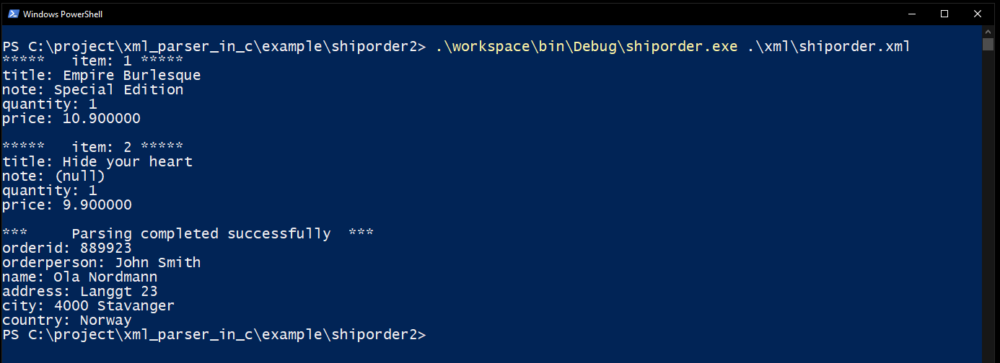

shiporder2
==========

This example demonstrate the parsing of an XML data using relative addressing and dynamic addressing method.
In this method the target address to store XML content is deduced at runtime. 
This example is same as [shiporder1.md][4], except it uses dynamic addressing type for "item" XML element.

In dynamic addressing type, parser calls Allocate function to get the target address to store content of an XML element.

## Schema
Schema of XML data to be parsed.

```XML
<?xml version="1.0" encoding="UTF-8" ?>
<xs:schema xmlns:xs="http://www.w3.org/2001/XMLSchema">

<xs:element name="shiporder">
  <xs:complexType>
    <xs:sequence>
      <xs:element name="orderperson" type="xs:string"/>
      <xs:element name="shipto">
        <xs:complexType>
          <xs:sequence>
            <xs:element name="name" type="xs:string"/>
            <xs:element name="address" type="xs:string"/>
            <xs:element name="city" type="xs:string"/>
            <xs:element name="country" type="xs:string"/>
          </xs:sequence>
        </xs:complexType>
      </xs:element>
      <xs:element name="item" maxOccurs="10">
        <xs:complexType>
          <xs:sequence>
            <xs:element name="title" type="xs:string"/>
            <xs:element name="note" type="xs:string" minOccurs="0"/>
            <xs:element name="quantity" type="xs:positiveInteger"/>
            <xs:element name="price" type="xs:decimal"/>
          </xs:sequence>
        </xs:complexType>
      </xs:element>
    </xs:sequence>
    <xs:attribute name="orderid" type="xs:string" use="required"/>
  </xs:complexType>
</xs:element>

</xs:schema>
```

The schema of above XML file is defined here [shiporder1.xsd][1].
the root element of this XML is "shiporder". It contains three child elements, and one attribute
- orderperson  : Name of person to ship order
- shipto       : Address
- item         : Description of items to be shipped

- orderid      : order id.


## shiporder_t
The structure *shiporder_t* represents data structure defined in the above schema. This structure can hold the content of XML data. It is defined in [shiporder.h][2].

```C
//! Structure that represents the data structure of "item" XML element
typedef struct
{
    char* title;        //!< Holds content of "title" XML element
    char* note;         //!< Holds content of "note" XML element
    uint32_t quantity;  //!< Holds content of "quantity" XML element
    float price;        //!< Holds content of "price" XML element
}item_t;

//! structure that represents the data structure of "shipto" XML element
typedef struct
{
    char* name;     //!< Holds content of "name" XML element
    char* address;  //!< Holds content of "address" XML element
    char* city;     //!< Holds content of "city" XML element
    char* country;  //!< Holds content of "country" XML element
}shipto_t;

//! Structure that represents the data structure of shiporder XML schema
typedef struct
{
    char* orderperson;  //!< Holds content of "orderperson" XML element
    shipto_t shipto;    //!< Holds content of "shipto" XML element
    item_t* item;       //!< Holds content of "item" XML element
    char* orderid;      //!< Holds content of "orderid" attribute
}shiporder_t;

```

## xs_element_t
[shiporder.c][3] file contains *xs_element_t* structure for all the elements of XML schema including root element "shiporder".
This structure contains all the validation rules of an XML element specified in the schema.
It also specifies the target address to store the content of an XML element.

- **xs_element_t shiporder_root**        : Holds properties of root element "shiporder".
- **xs_attribute_t shiporder_attribute** : Holds properties of attributes of root element "shiporder".
- **xs_element_t shiporder_descendant**  : Holds properties of all the child elements of root element "shiporder". Child elements: orderperson, shipto, item
- **xs_element_t shipto_descendant**     : Holds properties of all the child elements of "shipto" XML element. Child elements: name, address, city, country
- **xs_element_t item_descendant**       : Holds properties of all the child elements of "item" XML element. Child elements: title, note, quantity, price

In this example target address type for all the elements except "item" are relative (EN_RELATIVE). i.e. Target address of an element is an offset to target address of its parent element.
For root element, target address is offset to address passed in the 3rd argument (void* const target) of `parse_xml` function.
The addressing type for "item" element is dynamic. Where it uses *Allocate* callback function to get target address to store content of "item" element.

## Handling mulitple occurrence of an element

The maxOccurs of "item" element is 10. It can occur in an XML data from 1 to 10 times.
One way to handle multiple occurrence is to use dynamic memory to store content of an element.

- **Allocate**: This example uses *allocate_item* callback function to get target address to store content of *item* element. 
Parser calls this function before extracting the content of an element or before parsing its child elements.
In this case *item* element doesn't have any content. It has four child elements. 
All these child elements uses "relative" addressing type to store their content in the allocated memory.

- **Callback function**: The example uses *deallocate_item* function to be called for each occurrence of "item" element.
The parser calls this callback when it completes the parsing **item** element including its child elements.
This callback function consumes the content of "item" element and then it frees the allocated memory.


## How to build and run

This example doesn't uses any platform/OS specific libraries. You only need standard C99 compiler to build this example.

This example uses element callback in the XML parser. By default callback for element is disabled to save code space.
Enable element callback by defining **XML_PARSER_CALLBACK** to 1.
Use compiler -D option to set these macros, e.g. `-DXML_PARSER_CALLBACK="1"


This is a console application. Execute the application in the command line and provide the path of an XML file in the command line argument. 
The application will print the extracted XML data on the console.

`shiporder.exe xml/shiporder.xml`





[1]: xml/shiporder1.xsd
[2]: src/shiporder.h
[3]: src/shiporder.c
[4]: ../shiporder1/README.md